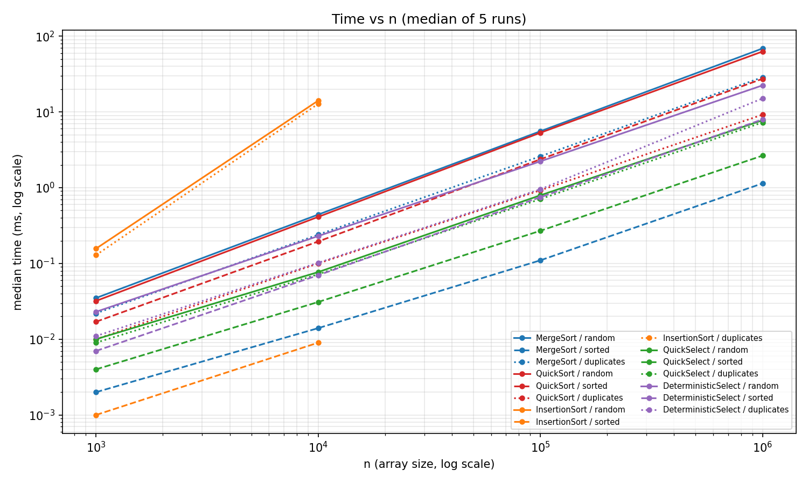
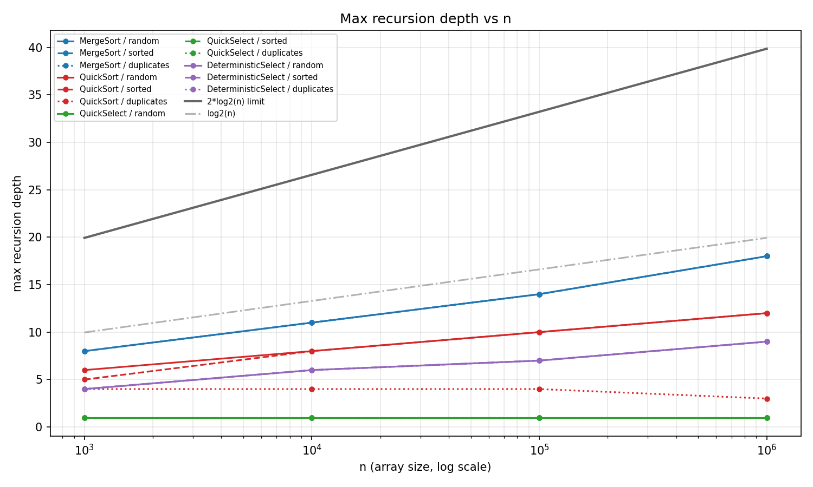
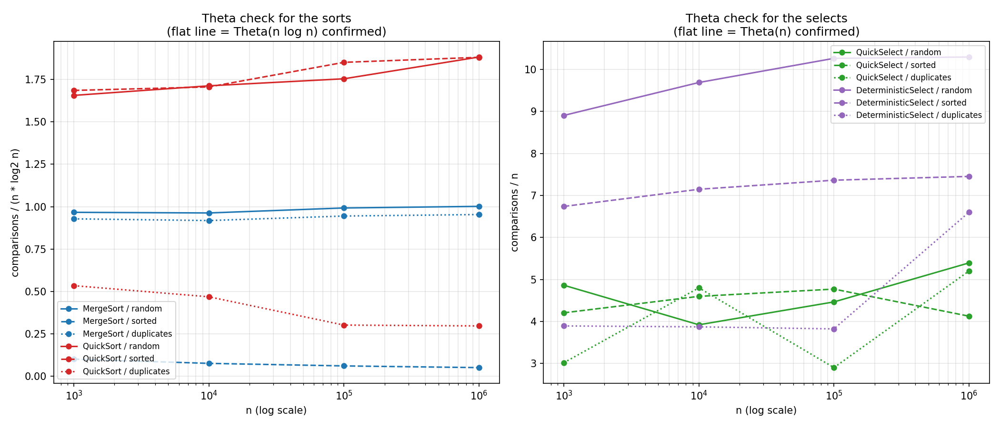

# Assignment 1 — Divide and Conquer & Asymptotic Notations

**Course:** Design and Analysis of Algorithms
**Author:** Taubakabyl Nurlybek
**Version:** v1.0

All numbers in this report come from `results.csv`, produced by
`cli.BenchmarkRunner` on this machine (JDK 25, Apple Silicon). Every case is the
**median of 5 runs** after an untimed JVM warm-up pass.

---

## 1. Architecture notes

The project keeps algorithms, instrumentation, driver and tests apart:

| Package | Contents |
|---|---|
| `algorithms` | `MergeSort`, `QuickSort`, `QuickSelect`, `InsertionSort`, `Partition`, `DeterministicSelect`, `ClosestPair` |
| `metrics` | `Metrics` — comparisons, max recursion depth, allocations, nanosecond timer |
| `cli` | `BenchmarkRunner` — generates inputs, runs the suite, writes `results.csv` |

**How depth is controlled.** A `Metrics` object is passed into every algorithm
(no static counters), and each recursive method wraps its body in
`enterRecursion()` / `exitRecursion()` inside a `try/finally`, so the maximum is
recorded even if an exception unwinds the stack.

Three mechanisms keep the stack bounded and the allocations low:

1. **One buffer.** `MergeSort.sort` allocates `new int[a.length]` exactly once at
   the top level and threads it through the recursion. `merge()` never allocates.
   The test `mergeSortAllocatesOneBuffer` asserts `allocations == 1` for
   n = 100 000.
2. **Smaller side first.** `QuickSort` recurses into the *smaller* partition and
   reassigns `lo`/`hi` for the larger one in a `while` loop. The recursive call
   therefore always covers at most half the current range, so real recursion
   depth is bounded by log₂(n) + O(1) — *independently of pivot luck*.
3. **3-way partition.** `Partition` collapses the whole equal-to-pivot band in a
   single pass, so inputs with few distinct values do not degrade to O(n²).

---

## 2. Asymptotic bounds

Θ is used where the bound is tight; O where only an upper bound holds.

| Algorithm | Best | Average | Worst | Space | Reason (which input causes the case) |
|---|---|---|---|---|---|
| **MergeSort** | Θ(n log n) | Θ(n log n) | Θ(n log n) | Θ(n) | The split is always exactly in half, so the recursion tree has the same shape for every input. *(Our skip-merge check makes already-sorted input Θ(n) in practice — see §5.)* |
| **QuickSort** | Θ(n log n) | Θ(n log n) | O(n²) | Θ(log n) | Best/average: a random pivot splits the range in a constant ratio. Worst: every pivot is the min or max — possible but with probability ~1/n!, and the smaller-side-first loop keeps the *stack* at O(log n) even then. |
| **QuickSelect** | Θ(n) | Θ(n) | O(n²) | Θ(1) | Average: discarding a constant fraction each step gives n + n/2 + n/4 + … = 2n. Worst: repeatedly extreme pivots. Iterative loop ⇒ O(1) stack. |
| **DeterministicSelect** (MoM) | Θ(n) | Θ(n) | **Θ(n)** | Θ(log n) | The median-of-medians pivot *guarantees* at least a 30/70 split, so the worst case is linear too — the price is a larger constant. |
| **InsertionSort** | Θ(n) | Θ(n²) | Θ(n²) | Θ(1) | Best: already sorted — one failing comparison per element. Worst: reverse-sorted — every element shifts the whole prefix. |
| **ClosestPair** | Θ(n log n) | Θ(n log n) | Θ(n log n) | Θ(n) | The split is always in half and the strip scan is linear, so the shape is input-independent. |

Note on **space**: the figures are *auxiliary* space. QuickSort's Θ(log n) is
stack only; MergeSort's Θ(n) is the single shared buffer.

---

## 3. Recurrences and the Master Theorem

The Master Theorem applies to `T(n) = a·T(n/b) + f(n)`, comparing `f(n)` against
`n^(log_b a)`.

### MergeSort — Case 2

```
T(n) = 2·T(n/2) + Θ(n)
a = 2, b = 2, f(n) = Θ(n)
n^(log_b a) = n^(log_2 2) = n^1 = n
f(n) = Θ(n) = Θ(n^(log_b a))     → Case 2
T(n) = Θ(n^(log_b a) · log n) = Θ(n log n)
```

The Insertion Sort cutoff changes the base case, not the growth rate: it
truncates the bottom ~4 levels of the recursion tree (2^4 = 16 > 15), which
lowers the constant but leaves Θ(n log n) intact.

### QuickSort — Case 2 (assuming a balanced split)

```
T(n) = 2·T(n/2) + Θ(n)
a = 2, b = 2, f(n) = Θ(n)  →  same as MergeSort  →  Θ(n log n)
```

**Why a random pivot gives O(n log n) on average.** A pivot is "good" if it falls
in the middle 50% of the values, which happens with probability 1/2. A good pivot
leaves each side at most 3n/4 of the range, so at most log_{4/3}(n) ≈ 2.4·log₂(n)
good splits are needed to reach the base case. Since half of all pivots are good
in expectation, the expected number of partition levels is a constant factor
above log₂(n), and each level costs Θ(n) — giving Θ(n log n) expected time. The
worst case survives only for pathologically unlucky pivot sequences, whose
probability vanishes as n grows; crucially, it is *not* triggerable by choosing a
particular input, because the adversary cannot see our random numbers.

### QuickSelect — Case 3 (a different case)

```
T(n) = 1·T(n/2) + Θ(n)
a = 1, b = 2, f(n) = Θ(n)
n^(log_b a) = n^(log_2 1) = n^0 = 1
f(n) = Θ(n) grows polynomially FASTER than n^0 = 1   → Case 3
(regularity: a·f(n/b) = n/2 ≤ c·f(n) with c = 1/2 < 1 ✓)
T(n) = Θ(f(n)) = Θ(n)
```

This is the contrast the assignment asks for: MergeSort recurses into **both**
halves (a = 2) and lands in Case 2 with the extra `log n` factor, whereas
QuickSelect recurses into **one** half (a = 1) and lands in Case 3, where the
linear work at the top dominates the entire recursion. Intuitively the cost is
the geometric series n + n/2 + n/4 + … = 2n.

### DeterministicSelect — Master Theorem does **not** apply

```
T(n) ≤ T(n/5) + T(7n/10) + Θ(n)
```

The two subproblems have **different sizes**, so the `a·T(n/b)` form does not fit
and the Master Theorem cannot be used. Instead, substitution works: assume
T(m) ≤ c·m for all m < n, then

```
T(n) ≤ c·n/5 + c·7n/10 + d·n = c·(9n/10) + d·n = c·n − (c·n/10 − d·n)
```

which is ≤ c·n whenever c ≥ 10d. Since 1/5 + 7/10 = 9/10 < 1, the work shrinks
geometrically and **T(n) = Θ(n) in the worst case**. The 7n/10 term is the
guarantee from the median of medians: at least half of the ⌈n/5⌉ group medians
are ≤ the pivot, and each contributes 3 elements ≤ the pivot, so ≥ 3n/10
elements are discarded on each side.

### ClosestPair — Case 2

```
T(n) = 2·T(n/2) + Θ(n)     → Θ(n log n)
```

The Θ(n) merge step is achieved by keeping points y-sorted on the way *up* the
recursion (a MergeSort-style merge), rather than re-sorting the strip at each
level — re-sorting would give `2T(n/2) + Θ(n log n)` and hence Θ(n log²n).

---

## 4. Plots

| Plot | File |
|---|---|
| Time vs n | `docs/plots/time_vs_n.png` |
| Max recursion depth vs n | `docs/plots/depth_vs_n.png` |
| Ratio vs n (Θ check) | `docs/plots/ratio_vs_n.png` |





---

## 5. Θ verification from the ratio plot

The definition: `f(n) = Θ(g(n))` iff there exist `c₁, c₂, n₀ > 0` such that
`c₁·g(n) ≤ f(n) ≤ c₂·g(n)` for all `n ≥ n₀`. So if we plot
`comparisons / g(n)` and the curve **flattens**, the ratio is trapped between two
constants and Θ is confirmed.

### Sorts — ratio = comparisons / (n · log₂ n)

| Algorithm / input | n=10³ | n=10⁴ | n=10⁵ | n=10⁶ | Verdict |
|---|---|---|---|---|---|
| MergeSort / random | 0.967 | 0.963 | 0.992 | 1.002 | flat → **Θ(n log n)** |
| MergeSort / duplicates | 0.928 | 0.918 | 0.945 | 0.953 | flat → **Θ(n log n)** |
| MergeSort / sorted | 0.100 | 0.075 | 0.060 | 0.050 | **decays** → see below |
| QuickSort / random | 1.656 | 1.713 | 1.754 | 1.883 | flat → **Θ(n log n)** |
| QuickSort / sorted | 1.686 | 1.706 | 1.851 | 1.881 | flat → **Θ(n log n)** |
| QuickSort / duplicates | 0.534 | 0.468 | 0.301 | 0.296 | settles → **O(n log n)**, effectively Θ(n) |

**Constants.** For the flat series: MergeSort **c₁ ≈ 0.9, c₂ ≈ 1.05, n₀ ≈ 10³**;
QuickSort **c₁ ≈ 1.6, c₂ ≈ 2.0, n₀ ≈ 10³**. Both ratios are bounded above and
below by positive constants from the smallest measured size onward, so Θ(n log n)
is confirmed on real data.

**The two decaying rows are the interesting ones, and both are expected:**

- *MergeSort / sorted* measures exactly **n − 1** comparisons (999 / 9 999 /
  99 999 / 999 999). That is the skip-merge optimisation: when `a[mid-1] <= a[mid]`
  the two halves are already ordered end to end and the merge is skipped
  entirely. So this input is Θ(n), not Θ(n log n) — the ratio decaying like
  1/log₂(n) is precisely the signature of that. The *algorithm* is still
  Θ(n log n) in general; this is a best case the optimisation exposes.
- *QuickSort / duplicates* drops because the 3-way partition puts every equal
  element in final position in one pass. With only 10 distinct values the
  recursion bottoms out after ~log₂(10) levels, so the total work approaches
  Θ(n·distinct) = Θ(n). This is the payoff for the 3-way partition.

### Selects — ratio = comparisons / n

| Algorithm / input | n=10³ | n=10⁴ | n=10⁵ | n=10⁶ | Verdict |
|---|---|---|---|---|---|
| QuickSelect / random | 4.86 | 3.92 | 4.46 | 5.39 | bounded → **Θ(n)** |
| QuickSelect / sorted | 4.20 | 4.60 | 4.77 | 4.12 | bounded → **Θ(n)** |
| DeterministicSelect / random | 8.90 | 9.69 | 10.26 | 10.30 | flat → **Θ(n)** |
| DeterministicSelect / sorted | 6.74 | 7.15 | 7.36 | 7.45 | flat → **Θ(n)** |

**Constants.** QuickSelect **c₁ ≈ 2.9, c₂ ≈ 5.5, n₀ ≈ 10³**;
DeterministicSelect **c₁ ≈ 3.8, c₂ ≈ 10.5, n₀ ≈ 10³**. The ratio never trends
upward with n — it bounces inside a fixed band — so the comparison count is
linear, not n log n. (If it were Θ(n log n), this ratio would have to *double*
between n = 10³ and n = 10⁶, since log₂ goes 10 → 20. It does not.)

QuickSelect's bouncing is pivot luck: each run uses a different random seed, and
a single unlucky early pivot shifts the constant noticeably. DeterministicSelect
is visibly smoother, which is exactly what "deterministic" buys.

---

## 6. Bonus Task A — QuickSelect vs Median-of-Medians

Measured comparisons and median time for selecting the median (k = n/2):

| n | input | QuickSelect cmp | MoM cmp | QuickSelect ms | MoM ms | MoM / QS time |
|---|---|---|---|---|---|---|
| 100 000 | random | 446 400 | 1 026 325 | 0.794 | 2.230 | 2.8× |
| 1 000 000 | random | 5 392 898 | 10 295 126 | 7.767 | 22.454 | 2.9× |
| 100 000 | sorted | 476 904 | 736 194 | 0.270 | 0.749 | 2.8× |
| 1 000 000 | sorted | 4 123 860 | 7 451 894 | 2.652 | 7.979 | 3.0× |

**Explanation of the difference.** Median-of-medians performs roughly **2–2.5×
more comparisons** and runs **~3× slower**, even though both are Θ(n). The extra
cost is the price of the guarantee:

- MoM must sort every group of 5 (≈ 7 comparisons per group, so ≈ 1.4n
  comparisons) *before* it can even choose a pivot, and it then pays a recursive
  select on the n/5 medians. QuickSelect picks its pivot in O(1).
- MoM's recurrence carries two subproblems (n/5 + 7n/10 = 0.9n per level) versus
  QuickSelect's single ~0.5n, so MoM's geometric series converges more slowly:
  1/(1 − 0.9) = 10 versus 1/(1 − 0.5) = 2.
- The group sorting also has poor cache behaviour — it touches the array in a
  scattered pattern while swapping medians to the front.

**When each wins.** QuickSelect is the right default: its *expected* time is
better by a constant factor and its worst case is astronomically unlikely with a
random pivot. MoM earns its cost only when a worst-case *guarantee* is required —
adversarial input, hard real-time deadlines, or when the pivot source cannot be
trusted to be random. The measurements match this: MoM never wins on time, but
its comparison ratio (`≈10.3` at both 10⁵ and 10⁶ on random input) is the
flattest line in the whole study, which is the guarantee made visible.

## 7. Bonus Task B — Closest Pair of Points

| n | time (ms) | comparisons | max depth |
|---|---|---|---|
| 1 000 | 0.508 | 11 825 | 10 |
| 10 000 | 4.481 | 161 707 | 13 |
| 100 000 | 52.899 | 2 032 367 | 17 |

Time grows by ~8.8× and then ~11.8× for each 10× increase in n — close to the
`10 · log(10n)/log(n)` factor that Θ(n log n) predicts (≈13.3 and ≈12.5), and far
from the 100× that a quadratic algorithm would show. Depth tracks log₂(n)
(10 ≈ log₂1000, 17 ≈ log₂100000) as expected from halving. Correctness is verified
against the O(n²) brute force on 100 random point sets plus collinear and
duplicate-point edge cases.

---

## 8. Discussion — do the measurements match the theory?

**Yes, with three informative deviations.**

The agreement is strongest where the theory is least input-dependent. MergeSort's
ratio sits at 0.96–1.00 across three orders of magnitude, which is about as clean
a Θ(n log n) confirmation as measurement allows. QuickSort's depth is the other
clear win: on a **sorted array of 1 000 000 elements** — the classic input that
makes naive QuickSort blow the stack — measured `max_depth` is **12**, against a
theoretical limit of 2·log₂(10⁶) ≈ 39. The smaller-side-first loop works exactly
as designed, and the `largeInputsDoNotOverflow` test confirms no
`StackOverflowError` at n = 10⁶.

**Deviation 1 — constant factors are not predicted by asymptotics.** QuickSort
performs ~1.9 comparisons per `n log₂ n` versus MergeSort's ~1.0, yet QuickSort
is consistently *faster in wall-clock time* (62.9 ms vs 69.0 ms on random 10⁶).
Comparisons are the wrong unit for predicting time: QuickSort partitions in place
with sequential access, while MergeSort writes through a separate buffer, so it
moves roughly twice the memory. On modern hardware the cache traffic dominates
the comparison count. This is the clearest lesson in the data — two algorithms in
the same complexity class can trade places depending on constants the notation
deliberately hides.

**Deviation 2 — best cases the notation hides.** MergeSort on sorted input is
Θ(n), not Θ(n log n), because of the skip-merge check; it is 60× faster than on
random input at n = 10⁶ (1.14 ms vs 68.97 ms). Likewise QuickSort on duplicates
runs in 9.2 ms versus 62.9 ms on random data. Neither contradicts the analysis —
both are legitimate best cases — but both show why the ratio plot is necessary:
a single measurement at one n could not distinguish them from a wrong bound.

**Deviation 3 — measurement noise at small n.** Below n ≈ 10⁴ the timings are
unstable and the select ratios bounce (QuickSelect/duplicates swings 2.9–5.2).
Four effects are responsible:

- **JVM warm-up.** The first runs execute in the interpreter before C2 compiles
  the hot loops; this is why the harness warms up and reports the **median** of 5
  rather than the mean, which a single slow first run would skew badly.
- **Garbage collector.** MergeSort's 4 MB buffer at n = 10⁶ can trigger a young
  collection mid-run, adding a millisecond that has nothing to do with the
  algorithm.
- **CPU cache.** At n = 10³ the whole array fits in L1 and timing is dominated by
  loop overhead; by n = 10⁶ (4 MB) it exceeds L2, so memory latency dominates.
  This is why per-element cost rises faster than log n suggests.
- **Cutoff size.** The 15-element cutoff removes the bottom levels of the
  recursion, where overhead per element is highest; it changes the constant, not
  the asymptotics, but at n = 10³ that constant *is* most of the runtime.

**Conclusion.** Every measured curve lands in its predicted complexity class, and
the two places where the ratio is *not* flat both turn out to be optimisations
behaving correctly rather than analysis errors. The asymptotics predict the
shape; the constants — cache behaviour, buffer traffic, pivot luck — decide which
algorithm actually wins.
